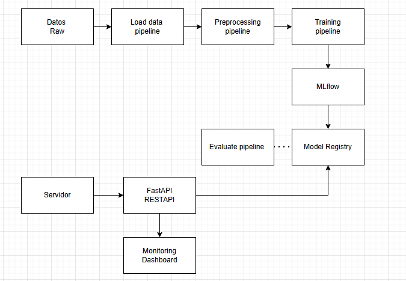

# Arquitectura del Sistema

El sistema procesa datos crudos, aplica un pipeline de preprocessing y feature engineering, entrena y compara modelos con seguimiento en MLflow, publica el mejor modelo y artefactos, y sirve predicciones mediante una API REST. El stack está dockerizado y monitorizado.

Flujo principal:
- Data Ingestion: CSV/BD → validación y versionado.
- Preprocessing: limpieza, scaling y creación de features (pipelined transformers, joblib).
- Training & Evaluation: entrenamiento de varios modelos (scikit-learn, XGBoost, LightGBM, CatBoost), comparación y registro (MLflow + metadata YAML).
- Model Registry / Artefacts: modelos y preprocessors guardados en `artifacts/models` y `preprocessors`.
- Serving: FastAPI + Uvicorn/Gunicorn en contenedores Docker (endpoints `/predict`, `/health`, `/metrics`).
- Monitoring: métricas expuestas (`/metrics`) y recopiladas por Prometheus; visualización y alertas en Grafana.

Tecnologías clave (resumen): Python, pandas, scikit-learn, xgboost, lightgbm, catboost, joblib, PyYAML, MLflow, FastAPI, Uvicorn/Gunicorn, Docker/Docker Compose, Prometheus, Grafana.