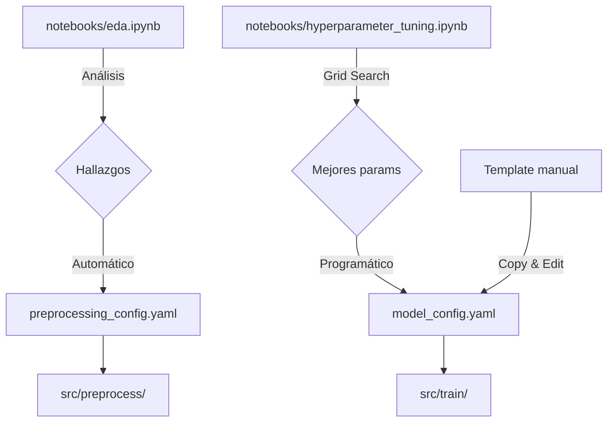

# Configuración

> Archivos YAML que controlan el comportamiento del sistema

## 📂 Ubicación
```
src/configs/
├── preprocessing_config.yaml    # Preprocesamiento y feature engineering
└── model_config.yaml            # Modelos y hiperparámetros
```

---

## 🎯 Propósito

Los archivos de configuración **separan lógica de datos**, permitiendo:
- ✅ Modificar comportamiento sin cambiar código
- ✅ Versionado de configuraciones
- ✅ Experimentación rápida
- ✅ Reproducibilidad

---

## 📄 1.`preprocessing_config.yaml`

### **Origen**

Este archivo se **genera automáticamente** desde el notebook `eda.ipynb` basándose en hallazgos del análisis exploratorio.

### **Generación desde EDA**

**En `notebooks/eda.ipynb`**: 

```python
import yaml

# Configuración basada en hallazgos de EDA
eda_config = {
    'missing_values': {
        'mean': ['CRIM', 'ZN'],           # Variables con distribución normal
        'median': ['AGE', 'LSTAT', 'RM'], # Variables sesgadas
        'most_frequent': [],
        'no_action': []
    },
    
    'outliers': {
        'log_transform': ['CRIM', 'B'],   # Outliers extremos → Log transform
        'iqr_capping': ['RM'],            # Outliers moderados → IQR capping
        'winsorization': {
            'columns': ['LSTAT'],
            'limits': [0.05, 0.05]        # Winsorización 5% superior/inferior
        },
        'no_action': []
    },
    
    'correlation': {
        'threshold':  0.9,                 # TAX e INDUS correlacionan 0.92
        'method': 'pearson'
    },
    
    'scaling': {
        'method': 'robust'                # RobustScaler para datos con outliers
    },
    
    'feature_engineering': {
        'interactions': [
            {
                'type': 'product',
                'features': ['RM', 'LSTAT'],  # Interacción importante
                'name': 'RM_x_LSTAT'
            },
            {
                'type':  'ratio',
                'features': ['LSTAT', 'RM'],
                'name':  'LSTAT_per_RM'
            }
        ]
    }
}

# Guardar en YAML
with open('../src/configs/preprocessing_config.yaml', 'w', encoding='utf-8') as fh:
    yaml.dump(
        eda_config, 
        fh,
        default_flow_style=False,  # Formato legible (no inline)
        sort_keys=False,            # Mantiene orden del diccionario
        indent=2,                   # Indentación de 2 espacios
        allow_unicode=True          # Soporte UTF-8
    )

print('✓ Guardado:  src/configs/preprocessing_config.yaml')
```

### **Estructura Completa**

```yaml
# ============================================================================
# PREPROCESSING CONFIGURATION
# ============================================================================

# ----------------------------------------------------------------------------
# 1.MISSING VALUES
# ----------------------------------------------------------------------------
missing_values: 
  mean:               # Imputar con media (para distribuciones normales)
    - CRIM
    - ZN
  
  median:            # Imputar con mediana (para distribuciones sesgadas)
    - AGE
    - LSTAT
    - RM
  
  most_frequent:     # Imputar con moda (para categóricas)
    []
  
  no_action:          # No imputar
    []

# ----------------------------------------------------------------------------
# 2.OUTLIERS
# ----------------------------------------------------------------------------
outliers:
  log_transform:     # Transformación logarítmica (outliers extremos)
    - CRIM
    - B
  
  iqr_capping:       # Capping por IQR (outliers moderados)
    - RM
  
  winsorization:     # Winsorización (reemplazar extremos por percentiles)
    columns:
      - LSTAT
    limits:  [0.05, 0.05]  # 5% inferior y superior
  
  no_action:         # No tratar outliers
    []

# ----------------------------------------------------------------------------
# 3.CORRELATION
# ----------------------------------------------------------------------------
correlation:
  threshold: 0.9     # Eliminar features con correlación > 0.9
  method: pearson    # Método:  pearson, spearman, kendall

# ----------------------------------------------------------------------------
# 4.SCALING
# ----------------------------------------------------------------------------
scaling:
  method: robust     # Opciones: robust, standard

# ----------------------------------------------------------------------------
# 5.FEATURE ENGINEERING
# ----------------------------------------------------------------------------
feature_engineering:
  interactions: 
    - type: product              # Multiplicación
      features: [RM, LSTAT]
      name: RM_x_LSTAT
    
    - type: ratio                # División
      features: [LSTAT, RM]
      name:  LSTAT_per_RM
    
    # Más interacciones...
    # - type: diff               # Resta
    # - type: sum                # Suma
```

### **Modificación**

#### Opción 1: Editar manualmente
```bash
nano src/configs/preprocessing_config.yaml
```

#### Opción 2: Regenerar desde EDA
```python
# En notebooks/eda.ipynb, modificar eda_config y ejecutar celda de guardado
```

#### Opción 3: Crear versiones alternativas
```bash
# Crear variante
cp src/configs/preprocessing_config.yaml src/configs/preprocessing_v2.yaml

# Usar variante
python -m src.preprocess.run_preprocess --config src/configs/preprocessing_v2.yaml
```

---

## 📄 2.`model_config.yaml`

### **Origen**

Este archivo se crea **manualmente** con las especificaciones de modelos y hiperparámetros.

### **Cómo Mejorarlo**

#### **Situación Actual** (Manual):
```yaml
# Creado manualmente
models:
  xgboost:
    module: 'xgboost'
    class: 'XGBRegressor'
    params:
      max_depth: 6
      learning_rate: 0.1
```

#### **Mejora 1: Template con valores por defecto**

Crear `src/configs/model_config_template.yaml`:
```yaml
# ============================================================================
# MODEL CONFIGURATION TEMPLATE
# ============================================================================

training:
  mlflow: 
    tracking_uri: 'artifacts/mlruns'
    experiment_name:  'house_price_prediction'
  
  validation: 
    cv_folds: 5
    random_state: 42

# ----------------------------------------------------------------------------
# MODELS
# ----------------------------------------------------------------------------

models:
  # Random Forest
  random_forest:
    module: 'sklearn.ensemble'
    class: 'RandomForestRegressor'
    params:
      n_estimators: 100
      max_depth: 10
      random_state: 42
      n_jobs: -1
  
  # XGBoost
  xgboost:
    module: 'xgboost'
    class: 'XGBRegressor'
    params:
      max_depth: 6
      learning_rate: 0.1
      n_estimators: 100
      random_state: 42
  
  # LightGBM
  lightgbm:
    module: 'lightgbm'
    class: 'LGBMRegressor'
    params: 
      num_leaves: 31
      learning_rate: 0.05
      n_estimators: 100
      random_state: 42

# ----------------------------------------------------------------------------
# MODEL SELECTION
# ----------------------------------------------------------------------------

selection: 
  metric: 'val_rmse'      # Métrica para seleccionar mejor modelo
  mode: 'min'             # min o max
```

#### **Mejora 2: Generación programática desde notebook**

**En `notebooks/03_hyperparameter_tuning.ipynb`** (nuevo):
```python
import yaml
from sklearn.model_selection import GridSearchCV

# 1.Hacer tuning
param_grid = {
    'max_depth': [4, 6, 8],
    'learning_rate': [0.01, 0.05, 0.1],
    'n_estimators': [100, 200, 300]
}

grid_search = GridSearchCV(XGBRegressor(), param_grid, cv=5)
grid_search.fit(X_train, y_train)

# 2.Obtener mejores parámetros
best_params = grid_search.best_params_

# 3.Generar config
model_config = {
    'training': {
        'mlflow':  {
            'tracking_uri':  'artifacts/mlruns',
            'experiment_name': 'house_price_prediction'
        },
        'validation': {
            'cv_folds':  5,
            'random_state': 42
        }
    },
    'models': {
        'xgboost': {
            'module': 'xgboost',
            'class': 'XGBRegressor',
            'params': best_params  # ← Parámetros óptimos del tuning
        }
    }
}

# 4.Guardar
with open('../src/configs/model_config.yaml', 'w') as f:
    yaml.dump(model_config, f, default_flow_style=False, indent=2)

print('✓ Guardado: model_config.yaml con parámetros óptimos')
```

#### **Mejora 3: Múltiples configs para experimentación**

```
src/configs/
├── preprocessing_config.yaml
├── model_config_baseline.yaml      # Modelos simples
├── model_config_tuned.yaml         # Modelos optimizados
└── model_config_ensemble.yaml      # Ensemble de modelos
```

**Uso**:
```bash
# Entrenar con baseline
python -m src.train.run_train --config src/configs/model_config_baseline.yaml

# Entrenar con tuned
python -m src.train.run_train --config src/configs/model_config_tuned.yaml
```

---

## 📊 Flujo de Generación de Configs



---

## ✅ Buenas Prácticas

### 1.**Versionado**
```bash
# Commitear configs junto al código
git add src/configs/*.yaml
git commit -m "feat: nueva config con log transform en CRIM"
```

### 2.**Documentación inline**
```yaml
# Agregar comentarios explicativos
outliers:
  log_transform: 
    - CRIM  # Distribución muy sesgada (EDA mostró outliers extremos)
    - B     # Variable con valores atípicos
```

### 3.**Validación**
El código valida que las configuraciones sean válidas:
```python
# Los módulos validan que features en config existan
if 'CRIM' not in X_train.columns:
    raise ValueError("Feature CRIM en config no existe en datos")
```

### 4.**Experimentación**
```bash
# Crear variantes para experimentos
cp preprocessing_config.yaml preprocessing_no_log.yaml

# Editar:  Quitar log_transform
# Ejecutar y comparar resultados en MLflow
```

---

## 🔧 Ejemplo Completo:  Workflow

### 1.EDA → Generar `preprocessing_config.yaml`
```python
# En notebooks/eda.ipynb
# ...análisis ...
# Generar config basado en hallazgos
with open('../src/configs/preprocessing_config.yaml', 'w') as f:
    yaml.dump(eda_config, f, default_flow_style=False)
```

### 2.Hyperparameter Tuning → Generar `model_config.yaml`
```python
# En notebooks/hyperparameter_tuning.ipynb (crear)
# ...grid search ...
# Guardar mejores parámetros en config
with open('../src/configs/model_config.yaml', 'w') as f:
    yaml.dump(model_config, f, default_flow_style=False)
```

### 3.Ejecutar pipelines con configs
```bash
python -m src.preprocess.run_preprocess   # Usa preprocessing_config.yaml
python -m src.train.run_train             # Usa model_config.yaml
```

---

## 📝 Template para Nuevos Configs

```yaml
# ============================================================================
# [NOMBRE DEL CONFIG]
# Generado desde:  [notebooks/xxx.ipynb o manual]
# Fecha:  [YYYY-MM-DD]
# Descripción: [Propósito de esta configuración]
# ============================================================================

# Sección 1
seccion1:
  parametro1: valor1  # Comentario explicativo
  parametro2: valor2

# Sección 2
seccion2:
  # ...
```

---

## ⚠️ Consideraciones

- **No hardcodear**:  Evita valores mágicos en código, usa configs
- **DRY**: No repetir configuraciones, usa referencias YAML si es necesario
- **Testing**: Prueba configs en notebooks antes de automatizar
- **Backup**: Git guarda historial de cambios en configs

---

## 🔗 Ver también

- [Preprocess Module](./modules/preprocess.md) - Uso de `preprocessing_config.yaml`
- [Train Module](./modules/train.md) - Uso de `model_config.yaml`
- [Notebooks](./notebooks.md) - Generación de configs desde EDA