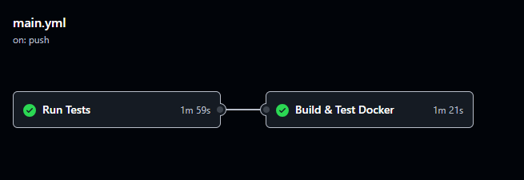

# CI/CD con GitHub Actions

> Integración y deployment continuo automatizado

## 🎯 Propósito

Cada push a `main` ejecuta automáticamente:
1. ✅ Tests (pytest)
2. ✅ Docker build (validación)
3. ✅ Health check (API funcional)

---

## 📊 Workflow Actual

**Archivo:** `.github/workflows/ci.yml`

### **Job 1: Run Tests**
```yaml
test:
  - Setup Python 3.9
  - Install dependencies
  - Run pytest
```

**Duración:** ~2 min

### **Job 2: Build & Test Docker**
```yaml
docker: 
  - Build Docker image
  - Start services (docker compose up)
  - Wait for API (20s)
  - Health check (curl /health)
  - Cleanup (docker compose down)
```

**Duración:** ~1 min

---

## ✅ Verificar estado

**URL:** https://github.com/jjhurtadoa/MLOPS_credits/actions



---

## 🔧 Cómo funciona

### **Trigger:**
```yaml
on:
  push: 
    branches: [main, develop]
  pull_request:
    branches:  [main]
```

### **Runners:**
- **Plataforma:** Ubuntu (GitHub-hosted)
- **Duración máxima:** 6 horas
- **Concurrencia:** Ilimitada (free tier)

---

## 🚀 Mejoras futuras

### **1. Deployment automático**
```yaml
deploy:
  needs: [test, docker]
  steps:
    - Deploy to Railway/Heroku
    - Run smoke tests
```

### **2. Multi-environment**
```yaml
- develop → staging
- main → production (manual approval)
```

### **3. Notificaciones**
```yaml
- Slack on failure
- Email on success
```

---

## 🔗 Ver también

- [GitHub Actions Docs](https://docs.github.com/en/actions)
- [Oportunidades de mejora](../improvements.md)

---

[Índice](../index.md)