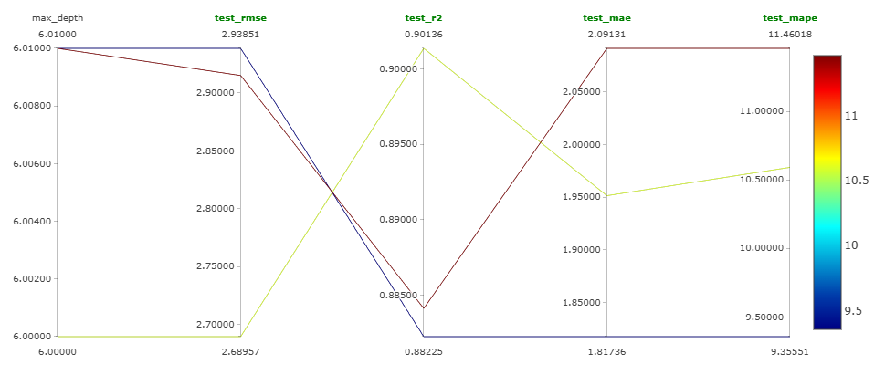

# MLflow — Quick Reference

> Tracking ligero para experimentos: parámetros, métricas y artifacts.

## ¿Para qué usarlo?
- Registrar runs reproducibles durante entrenamiento.
- Comparar hiperparámetros y métricas rápidamente (UI).
- Versionar y registrar modelos (Model Registry).

---

## Levantar UI (Quick start)
```bash
# desde la raiz del repo
mlflow ui --backend-store-uri artifacts/mlruns --port 5000
# UI: http://localhost:5000
```

> Si prefieres usar la URL absoluta en Windows: `mlflow ui --backend-store-uri file:///C:/full/path/to/artifacts/mlruns --port 5000`

---

## Función principal (resumido)
- `mlflow.log_param(key, value)` — registra un parámetro.
- `mlflow.log_metric(key, value)` — registra una métrica (por run).
- `mlflow.log_artifact(path)` — sube un archivo como artifact.
- `mlflow.sklearn.log_model(model, artifact_path, registered_model_name=...)` — serializa y opcionalmente registra en Model Registry.

Ejemplo mínimo (en training script):
```python
with mlflow.start_run(run_name='xgboost_baseline'):
    mlflow.log_params(params)
    model.fit(X_train, y_train)
    mlflow.log_metric('test_rmse', rmse)
    mlflow.sklearn.log_model(model, 'model', registered_model_name='boston_housing_xgboost')
```

---

## Imagen — ejemplo de la UI



---

## Notas rápidas
- El tracking store por defecto aquí está en `artifacts/mlruns` (repo-local). Para producción usa un servidor/DB remoto.
- MLflow no sustituye evaluaciones detalladas: combínalo con `src/evaluate` para análisis por segmentos antes de deploy.

---

## Enlaces
- MLflow docs: https://mlflow.org/docs/latest/
- Tracking API: https://mlflow.org/docs/latest/tracking.html